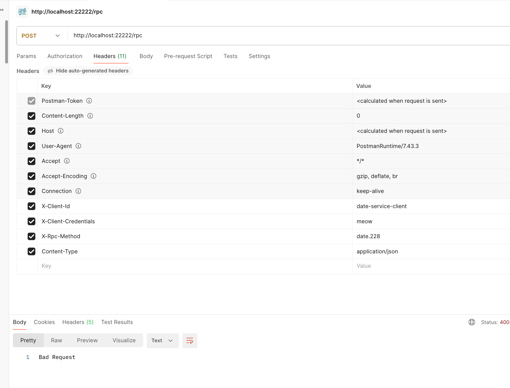

# Как я делал практику

Сделал на базе Alpine Linux запуск date-service, core-service, loadbalancer. 

RPC-запрос работает нормально:




# Теория, третий вопрос

## Вопрос

3. Балансировка / распределение нагрузки
· использование Nginx в качестве балансировщика (r)
· маршрутизация с использованием ltin (эндпоинты)
· условная маршрутизация IF
· таблицы сопоставления MAP
· группировка сервисов UPSTRAM
· коды ответов HTTP сервера (ошибки, перенаправление и др.)
Описать основные принципы логической маршрутизации на основе сравнения
заголовков (методов) запроса. Описать принципы распределения нагрузки с
использованием Ustrm (rund-rbin, wight и т.д.).

## Ответ

Nginx - гибкий веб-сервер, с помощью которого можно делать разные вещи. В частности, его можно использовать как балансировщик для распределения нагрузки.

Есть такое понятие как reverse proxy – это когда есть некий основной сервер Nginx, который скрывает всю внутрянку. Допустим, есть какой-то некий домен api.sirius.ru со своими эндпоинтами и, допустим, есть несколько backend-серверов, котоыре могут служить серверами для API. И, допустим, они все используют одну БД. 

Для начала надо определить апстрим (группу серверов) в nginx конфиге. Примерно таким образом:

```
upstream backend_servers {
    server backend1.sirius.ru:8080;
    server backend2.sirius.ru:8080;
    server 192.168.1.22:8080;
}
```

И далее использовать этот апстрим в основном блоке настройки:

```
server {
    listen 80;
    server_name example.com;

    location / {
        proxy_pass http://backend_servers; // тут мы используем этот апстрим
        proxy_set_header Host $host;
        proxy_set_header X-Real-IP $remote_addr;
        proxy_set_header X-Forwarded-For $proxy_add_x_forwarded_for;
        proxy_set_header X-Forwarded-Proto $scheme;
    }
}
```

Также, как показано в примере, можно задавать дополнительные заголовки к HTTP-запросам, которые будут дальше передаваться внутренним серверам.

location позволяет задать конкретным эндпоинтам какой-то конкретный маршрут. Или, к примеру, даже какой-то сервер. Допустим, на sirius.ru/api должен маршрутизировать какой-то один сервере, а на sirius.ru/web какой-то другой (ну, или просто на кореневой эндпоинт).

```
location /api/ {
    proxy_pass http://servers; // мы тут задаём какой-то апстрим серверов для /api эндпоинта
}
```

Есть маршрутизация при помощи ключевого слова IF. Она позволяет делать условную маршрутизаци. Допустим, если маршрут содержит какой-то определённый заголовок, надо использовать какой-то определённый сервер.

Есть такое понятие как таблицы сопоставления MAP. Они нужны для того, чтобы "маппить" (ну, сопоставлять некое одно значение к другому) значения переменных к присвоениями новых значений другим переменным при помощи условий.

В этом примере

```
map $host $backend {
    default backend_default;
    api.sirius.ru backend_api;
    mobile.sirius.ru backend_mobile;
}
```

Мы по сути задаём для api.sirius.ru пул серверов backend_api, а для mobile.sirius.ru – backend_mobile.

Коды HTTP-ответов:

Их много и все не перечислить, но есть такие основные группы кодов: 1XX (сервисные ответы), 2XX (успешные), 3XX (редирект), 4XX (ресурсы не найдены/не найдено/запрещено), 5XX (внутренние ошибки сервера)


fun website: [http.cat](https://http.cat)